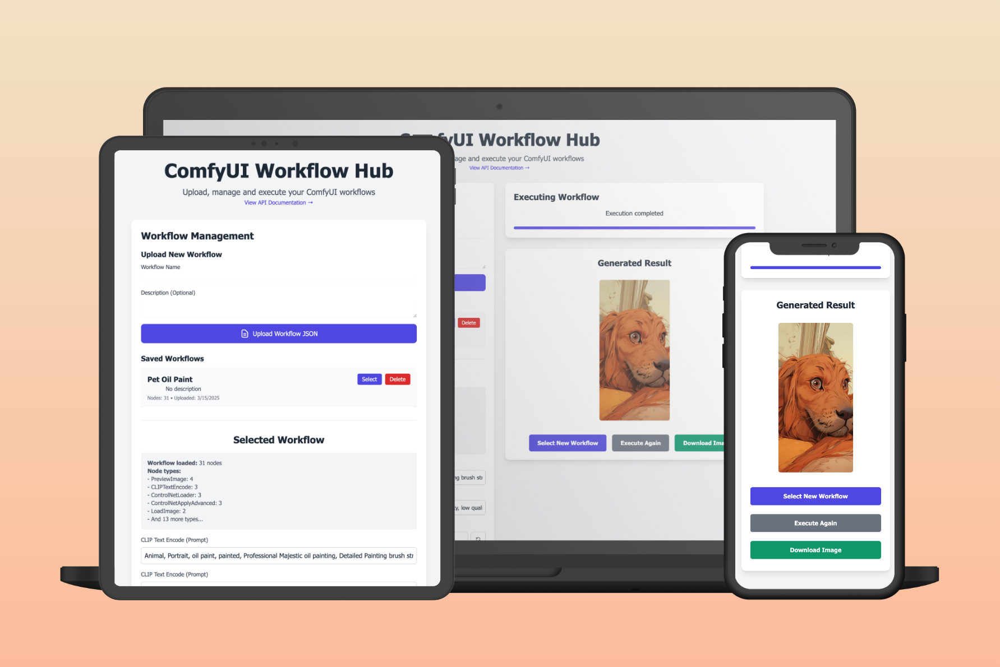

# ComfyUI Workflow Hub

A modern web interface for managing and executing ComfyUI workflows. This project provides a user-friendly way to upload, manage, and execute ComfyUI workflows through a clean web interface or API.



## Features

- 📁 **Workflow Management**
  - Upload and store ComfyUI workflow JSON files
  - Name and describe your workflows
  - Browse and manage saved workflows
  - Delete unused workflows

- 🎮 **Workflow Execution**
  - Execute workflows with custom inputs
  - Real-time progress tracking
  - Support for text prompts, seed values, and numeric inputs
  - Optional image inputs
  - Download generated results

- 🔌 **API Integration**
  - RESTful API for workflow management
  - WebSocket support for real-time updates
  - Comprehensive API documentation
  - Session-based execution tracking

- 💅 **Modern UI**
  - Clean, responsive design
  - Mobile-friendly interface
  - Real-time progress updates
  - Intuitive workflow management

## Prerequisites

- Node.js (v14 or higher)
- Running ComfyUI instance
- npm or yarn

## Installation

1. Clone the repository:
   ```bash
   git clone https://github.com/ennisma/comfyui-workflow-hub.git
   cd comfyui-workflow-hub
   ```

2. Install dependencies:
   ```bash
   npm install
   ```

   > **Note**: If you're getting "npm not recognized" errors, you need to install Node.js first. See the [detailed installation guide](INSTALLATION.md) for step-by-step instructions.

3. Create a `.env` file in the root directory by copying the example:
   ```bash
   cp .env.example .env
   ```
   Then edit the `.env` file with your configuration.

4. Start the server:
   ```bash
   npm start
   ```

5. Open your browser and navigate to `http://localhost:3000`

### Docker Installation (Alternative)

If you prefer using Docker:

```bash
# Build the Docker image
docker build -t comfyui-workflow-hub .

# Run the container
docker run -p 3000:3000 -e COMFYUI_URL=http://host.docker.internal:8188 comfyui-workflow-hub
```

See the [detailed installation guide](INSTALLATION.md) for more options and troubleshooting.

## API Documentation

### RESTful Endpoints

#### Workflow Management

##### List Workflows
```http
GET /api/workflows
```
Returns a list of all saved workflows.

**Response**
```json
{
  "workflows": [
    {
      "id": "workflow-123",
      "name": "My Workflow",
      "description": "A sample workflow",
      "created_at": "2024-03-20T12:00:00Z"
    }
  ]
}
```

##### Get Workflow Details
```http
GET /api/workflows/:id
```
Returns details of a specific workflow.

**Response**
```json
{
  "id": "workflow-123",
  "name": "My Workflow",
  "description": "A sample workflow",
  "created_at": "2024-03-20T12:00:00Z",
  "workflow_json": { ... }
}
```

##### Upload Workflow
```http
POST /api/upload-workflow
Content-Type: multipart/form-data
```
Upload a new workflow JSON file.

**Parameters**
- `workflow` (file, required) - The workflow JSON file
- `name` (string, required) - Workflow name
- `description` (string, optional) - Workflow description

**Response**
```json
{
  "id": "workflow-123",
  "name": "My Workflow",
  "message": "Workflow uploaded successfully"
}
```

##### Delete Workflow
```http
DELETE /api/workflows/:id
```
Delete a specific workflow.

**Response**
```json
{
  "message": "Workflow deleted successfully"
}
```

#### Workflow Execution

##### Upload Input Image
```http
POST /api/upload-image
Content-Type: multipart/form-data
```
Upload an input image for workflow execution.

**Parameters**
- `image` (file, required) - The input image file
- `sessionId` (string, required) - Current session ID

**Response**
```json
{
  "filename": "input-123.png",
  "message": "Image uploaded successfully"
}
```

##### Execute Workflow
```http
POST /api/execute
Content-Type: application/json
```
Execute a workflow with specified inputs.

**Request Body**
```json
{
  "workflowId": "workflow-123",
  "inputs": {
    "text_input": "sample prompt",
    "seed": 42,
    "image": "input-123.png"
  }
}
```

**Response**
```json
{
  "sessionId": "session-123",
  "message": "Workflow execution started"
}
```

##### Check Execution Status
```http
GET /api/status/:sessionId
```
Check the status of a workflow execution.

**Response**
```json
{
  "status": "running",
  "progress": 75,
  "message": "Generating image..."
}
```

##### Get Generated Image
```http
GET /api/images/:filename
```
Retrieve a generated image file.

### WebSocket API

Connect to the WebSocket endpoint for real-time updates:
```javascript
const ws = new WebSocket('ws://localhost:3000/ws?clientId=YOUR_CLIENT_ID');

ws.onmessage = (event) => {
  const data = JSON.parse(event.data);
  console.log('Received:', data);
  // Handle different message types:
  // - progress: Execution progress updates
  // - status: Status changes
  // - result: Final results
  // - error: Error messages
};
```

**Message Types**

1. Progress Update
```json
{
  "type": "progress",
  "data": {
    "progress": 75,
    "message": "Generating image..."
  }
}
```

2. Status Change
```json
{
  "type": "status",
  "data": {
    "status": "completed",
    "message": "Execution completed"
  }
}
```

3. Result
```json
{
  "type": "result",
  "data": {
    "images": ["output-123.png"],
    "message": "Generation successful"
  }
}
```

4. Error
```json
{
  "type": "error",
  "data": {
    "message": "Error executing workflow",
    "error": "Invalid input parameters"
  }
}
```

## Development

The project structure is organized as follows:

```
comfyui-workflow-hub/
├── public/
│   ├── index.html      # Main HTML file
│   ├── script.js       # Frontend JavaScript
│   └── styles.css      # Custom styles
├── api.js              # Backend API implementation
├── package.json        # Project dependencies
├── .env.example        # Example environment variables
└── README.md          # This file
```

## Contributing

Contributions are welcome! Please feel free to submit a Pull Request.

1. Fork the repository
2. Create your feature branch (`git checkout -b feature/AmazingFeature`)
3. Commit your changes (`git commit -m 'Add some AmazingFeature'`)
4. Push to the branch (`git push origin feature/AmazingFeature`)
5. Open a Pull Request

## License

This project is licensed under the MIT License - see the [LICENSE](LICENSE) file for details.

## Acknowledgments

- [ComfyUI](https://github.com/comfyanonymous/ComfyUI) - The awesome stable diffusion GUI
- [Tailwind CSS](https://tailwindcss.com/) - For the modern UI components

## Support

If you encounter any problems or have suggestions, please [open an issue](https://github.com/ennis-ma/comfyui-workflow-hub/issues). 
